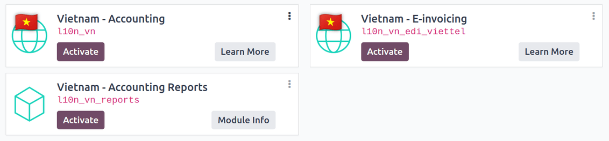
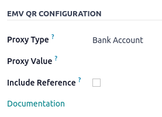
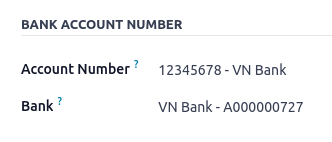
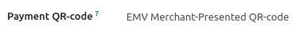

=======
Vietnam
=======

Configuration
=============

Modules installation
--------------------

:ref:`Install <general/install>` the following modules to get the latest features of the Vietnam
localization:

.. list-table::
    :header-rows: 1

    * - Name
      - Technical name
      - Description
    * - :guilabel:`Vientam - Accounting`
      - `l10n_vn`
      - The base module to manage chart of accounting and localization for Vietnam.
    * - :guilabel:`Vietnam - E-invoicing`
      - `l10n_vn_edi_viettel`
      - This module includes the features required for integation with S-Invoice.
    * - :guilabel:`Vietnam - Accounting Reports`
      - `l10n_vn_reports`
      - This module includes the accounting reports applicable for Vietnam fiscal localization.

.. note::
   When `Vietnam` is selected for a company's :guilabel:`Fiscal Localization`, Odoo automatically
   installs certain modules.

Configure your company
----------------------

To configure the company information, go to the :menuselection:`Contacts` app and search the name
given to your company.

#. Select the :guilabel:`Company` option at the top of the page. Then, configure the following fields:

   - :guilabel:`Name`
   - :guilabel:`Address`: add :guilabel:`City`, :guilabel:`State`, :guilabel:`Zip Code`,
     :guilabel:`Country`

     - | In the :guilabel:`Street` field, enter the street name, number, and any additional address
        information.
     - In the :guilabel:`Street 2` field, enter the neighborhood.

   - :guilabel:`Tax ID`: The tax identificaiton number

   .. image:: vietnam/contact-configuration.png
      :alt: Company configuration

#. Upload a company logo and :guilabel:`Save` the contact.

E-invoice using S-Invoice integration
=====================================

.. _S-Invoice: https://www.sinvoice.vn/

S-Invoice_ is an e-invoice service provided by Viettel, one of the biggest E-invoice service provider in Vietnam.

.. important::
   - | :guilabel:`Vietnam - E-invoicing module` must be installed in order to submit invoices to
      :guilabel:`S-Invoice`.

Set-up
------

Configuration on S-invoice
~~~~~~~~~~~~~~~~~~~~~~~~~~

Account on **S-Invoice** portal is needed to proceed with the integration.

#. Go to S-Invoice_ and :guilabel:`Log in` on the portal

   .. note::
      To create an account, contact :guilabel:`S-Invoice` directly on the portal.

#. Create e-invoice issuance notice and payment.

Configuration on Odoo
~~~~~~~~~~~~~~~~~~~~~

To connect Odoo database with S-invoice, :guilabel:`credentials` and :guilabel:`template invoice` needs to be
set first.

#. Go to :menuselection:`Accounting --> Configuration --> Settings`.

#. Under :guilabel:`Vietnamese Integration`, connect Odoo database with S-invoice account using :guilabel:`user name`
   and :guilabel:`password`. Set a default symbol if needed.

   .. image:: vietnam/sinvoice-configuration-accounting.png
      :alt: S-Invoice Configuration Accounting

#. Add :guilabel:`S-Invoice Templates` by going to :menuselection:`Accounting --> Configuration --> Templates`.

#. Click :guilabel:`New` to create a new template and add :guilabel:`Template code` and :guilabel:`Template Invoice Type`.

   .. image:: vietnam/sinvoice-configuration-template.png
      :alt: S-Invoice Configuration Templates

#. Add :guilabel:`Ivnoice Symbols` by selection. New symbol is available for creation directly or under
   :menuselection:`Accounting --> Configuration --> Symbol`.

   .. image:: vietnam/sinvoice-configuration-symbol.png
      :alt: S-Invoice Configuration Symbol

   .. important::
      Make sure that the :guilabel:`Address` and :guilabel:`Tax ID` of the company contact and the customer's contact is
      filled in properly.

Workflow
--------

Create an invoice
~~~~~~~~~~~~~~~~~

#. Go to :menuselection:`Accounting --> Customers --> Invoice` and :guilabel:`Click New` to create a new invoice.

#. Navigate to tab “S-invoice” to fill in Invoice Symbol in case the default Symbol was not set up in the General Settings.

   .. image:: vietnam/sinvoice-invoice-symbol.png
      :alt: S-Invoice Invoice Symbol

#. Post the invoice by clicking :guilabel:`Confirm`.

#. Click :guilabel:`Send & Print` and choose :guilabel:`Send to S-invoice`. Then click :guilabel:`Send`.

   .. image:: vietnam/sinvoice-invoice-confirm.png
      :alt: S-Invoice Invoice Confirm

#. Upon successful completion of issuing an e-invoice, :guilabel:`SInvoice` tab of the invoice is updated including
   :guilabel:`SInvoice Status`, :guilabel:`SInvoice Number` and the :guilabel:`Secret Code`.

   .. image:: vietnam/sinvoice-invoice-sent.png
      :alt: S-Invoice Invoice Sent

   .. note::
      The same e-invoice issued can be checked on the :guilabel:`S-Invoice`` portal by logging in.

Issue a replacement invoice
***************************

Replacement invoice refers to a reversal of the previous invoice and re-issuance of the invoice potentially from a misinput of
an information that has **not been tax declared yet**.

#. Go to :menuselection:`Accounting --> Customers --> Invoice` and navigate and open the invoice to be replaced.

#. Click :guilabel:`Credit Note` button

   .. image:: vietnam/sinvoice-rep-invoice.png
      :alt: S-Invoice Credit Note

#. Fill in the adjustement information indicated below and click :guilabel:`Reverse and Create Invoice`.

   .. image:: vietnam/sinvoice-rep-invoice-reverse-create.png
      :alt: S-Invoice Reverse and Create

   .. note::
      The :guilabel:`status` of the original invoice replaced will be updated to :guilabel:`"Replaced"`.

#. Upon successful completion of issuing an e-invoice, :guilabel:`SInvoice` tab of the invoice is updated

Issue an adjustment invoice
***************************

Adjustment invoice refers to a reversal of the previous invoice and re-issuance of the invoice potentially from a misinput of
an information that has **already been tax declared**.

#. Go to :menuselection:`Accounting --> Customers --> Invoice` and navigate and open the invoice to be replaced.

#. Click :guilabel:`Credit Note` button.

   .. image:: vietnam/sinvoice-rep-invoice.png
      :alt: S-Invoice Credit Note

#. Fill in the adjustement information indicated below and click :guilabel:`Reverse`.

   .. image:: vietnam/sinvoice-rep-invoice-reverse.png
      :alt: S-Invoice Reverse

   .. note::
      The :guilabel:`status` of the original invoice replaced will be updated to :guilabel:`"Adjusted"`.

#. Upon successful completion of issuing an e-invoice, :guilabel:`SInvoice` tab of the invoice is updated.

Cancel an Invoice
*****************

#. Go to :menuselection:`Accounting --> Customers --> Invoice` and navigate and open the invoice to be replaced.

#. Click :guilabel:`Request Cancel`.

   .. image:: vietnam/sinvoice-invoice-request-cancel.png
      :alt: S-Invoice Request Cancel

#. Fill in the adjustement information indicated below and click :guilabel:`Request Cancellation`.

   .. image:: vietnam/sinvoice-invoice-cancel.png
      :alt: S-Invoice Request Cancellation

Add Vietnamese QR banking codes to invoices
===========================================

Vietnamese QR banking is a payment service platform that allows customers to make instant domestic
payments to individuals and merchants in Vietnamese dong via online and mobile banking.

Activate QR codes
-----------------

Go to :menuselection:`Accounting --> Configuration --> Settings`. Under the :guilabel:`Customer
Payments` section, activate the :guilabel:`QR Codes` feature.

Vietnamese QR banking bank account configuration
------------------------------------------------

Go to :menuselection:`Contacts --> Configuration --> Bank Accounts` and select the bank account for
which you want to activate Vietnamese QR banking. Set the :guilabel:`Bank Identifier Code` on the
bank. Then set the :guilabel:`Proxy Type` and fill in the :guilabel:`Proxy Value` field depending on
the type you chose.

.. important::
   - The account holder's country must be set to `Vietnam` on its contact form.
   - The account holder's city is mandatory.
   - You could also include the invoice number in the QR code by checking the :guilabel:`Include
     Reference` checkbox.

.. seealso::
   :doc:`../accounting/bank`

Bank journal configuration
--------------------------

Go to :menuselection:`Accounting --> Configuration --> Journals`, open the bank journal, then fill
out the :guilabel:`Account Number` and :guilabel:`Bank` under the :guilabel:`Journal Entries` tab.

Issue invoices with Vietnamese QR banking QR codes
--------------------------------------------------

When creating a new invoice, open the :guilabel:`Other Info` tab and set the :guilabel:`Payment
QR-code` option to *EMV Merchant-Presented QR-code*.

Ensure that the :guilabel:`Recipient Bank` is the one you configured, as Odoo uses this field to
generate the Vietnamese QR banking QR code.
